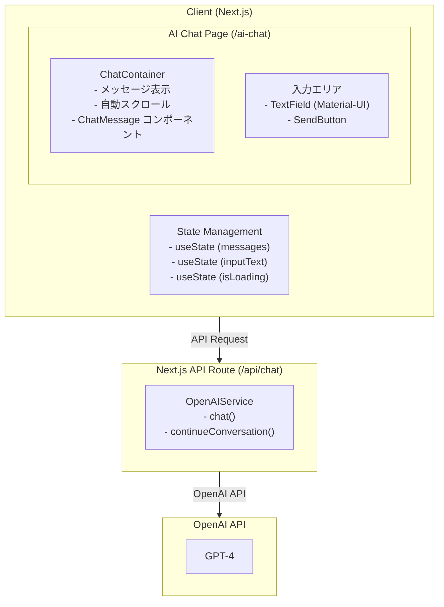
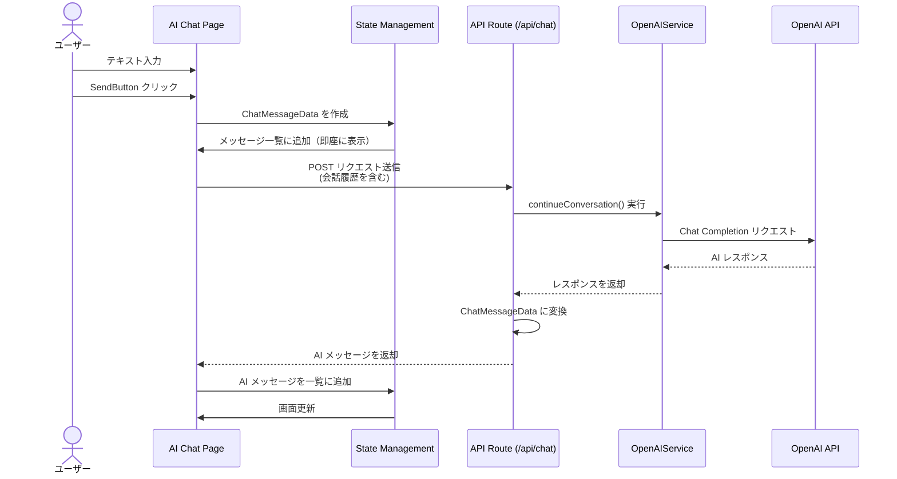

# AI Chat Tool

## 概要

OpenAI を使用した AI チャットツールです。nextjs-common の共通コンポーネントを活用し、ユーザーと AI の対話型インターフェースを提供します。

## アーキテクチャ

### システム構成



### ディレクトリ構造

```
client/tools/
├── app/
│   ├── ai-chat/
│   │   └── page.tsx                    # AI チャットページ
│   ├── api/
│   │   └── chat/
│   │       └── route.ts                # OpenAI API ルート
│   └── components/
│       └── ai-chat/
│           ├── AIChatContainer.tsx     # チャットメインコンテナ
│           ├── ChatInputArea.tsx       # 入力エリアコンポーネント
│           └── SystemPromptSelector.tsx # システムプロンプト選択
└── services/
    └── AIChatService.ts                # チャットロジック管理
```

## 主要コンポーネント

### UI コンポーネント

#### 1. ChatContainer (nextjs-common)

チャットメッセージを表示するコンテナコンポーネントです。

**利用するコンポーネント:**
- `nextjs-common/common/components/data/chat/ChatContainer.tsx`

**Props:**
```typescript
interface ChatContainerProps {
    messages: ChatMessageData[];
    height?: string | number;
    autoScroll?: boolean;
}
```

**特徴:**
- 自動スクロール機能
- メッセージ一覧の表示
- 空状態の表示

#### 2. ChatMessage (nextjs-common)

個々のメッセージを表示するコンポーネントです。

**利用するコンポーネント:**
- `nextjs-common/common/components/data/chat/ChatMessage.tsx`

**Props:**
```typescript
interface ChatMessageData {
    id: string;
    content: string;
    sender: 'user' | 'system';
    senderName?: string;
    timestamp?: Date;
    avatarIcon?: React.ReactNode;
}
```

**特徴:**
- ユーザー/AI の区別表示
- アバターアイコン対応
- タイムスタンプ表示
- 改行の正しい表示

**技術実装:**
- `whiteSpace: 'pre-wrap'` CSS プロパティにより、メッセージ内の改行文字（`\n`）を保持しつつ、長いテキストは適切に折り返します

#### 3. アバターアイコン (nextjs-common)

メッセージ送信者を視覚的に区別するアイコンです。

**利用するコンポーネント:**
- `nextjs-common/common/components/data/icon/Person.tsx` (ユーザー)
- `nextjs-common/common/components/data/icon/SmartToy.tsx` (AI)

#### 4. SendButton (nextjs-common)

メッセージ送信ボタンです。

**利用するコンポーネント:**
- `nextjs-common/common/components/inputs/buttons/SendButton.tsx`

**Props:**
```typescript
type SendButtonProps = {
    onClick: () => void;
    disabled?: boolean;
    label?: string;
};
```

### バックエンドサービス

#### OpenAIService (typescript-common)

OpenAI API との通信を管理するサービスです。

**利用するサービス:**
- `typescript-common/common/services/OpenAIService.ts`

**主要メソッド:**
```typescript
class OpenAIService {
    // 基本的なチャット
    chat(messages: OpenAIChatHistory, options?: OpenAIChatOptions): Promise<string>
    
    // 新しい会話の開始
    startConversation(systemPrompt: string, userMessage: string, options?: OpenAIChatOptions): Promise<string>
    
    // 会話の継続
    continueConversation(conversationHistory: OpenAIChatHistory, userMessage: string, options?: OpenAIChatOptions): Promise<string>
    
    // アシスタント応答の追加
    addAssistantResponse(conversationHistory: OpenAIChatHistory, assistantResponse: string): OpenAIChatHistory
}
```

**インターフェース:**
```typescript
// メッセージ型
interface OpenAIMessageType {
    role: OpenAIMessageRole;  // 'system' | 'user' | 'assistant'
    content: string;
}

// 会話履歴型
type OpenAIChatHistory = OpenAIMessageType[];

// オプション型
interface OpenAIChatOptions {
    model?: OpenAIModel;
    maxTokens?: number;
    temperature?: number;
}
```

## データフロー

### メッセージ送信フロー



### 状態管理

```typescript
// メッセージ履歴
const [messages, setMessages] = useState<ChatMessageData[]>([]);

// 入力テキスト
const [inputText, setInputText] = useState<string>('');

// ローディング状態
const [isLoading, setIsLoading] = useState<boolean>(false);

// OpenAI 会話履歴
const [conversationHistory, setConversationHistory] = useState<OpenAIChatHistory>([
    { role: 'system', content: 'あなたは親切なアシスタントです。' }
]);
```

## API 設計

### POST /api/chat

**リクエスト:**
```typescript
interface ChatRequest {
    conversationHistory: OpenAIChatHistory;
    userMessage: string;
    options?: {
        model?: string;
        temperature?: number;
        maxTokens?: number;
    };
}
```

**レスポンス:**
```typescript
interface ChatResponse {
    message: string;
    updatedHistory: OpenAIChatHistory;
}
```

**エラーレスポンス:**
```typescript
interface ErrorResponse {
    error: string;
    details?: string;
}
```

## 機能仕様

### 基本機能

#### 1. メッセージ送受信
- テキスト入力フィールドでメッセージ作成
- Enter キーまたは SendButton で送信
- AI からの応答を自動表示
- 送信中はローディング表示

#### 2. 会話履歴管理
- すべての会話を保持
- ChatContainer で時系列表示
- 自動スクロールで最新メッセージを表示
- 会話履歴を OpenAI API に渡して文脈を維持

#### 3. UI/UX
- ユーザーメッセージは右寄せ・青色
- AI メッセージは左寄せ・グレー色
- Person アイコン（ユーザー）
- SmartToy アイコン（AI）
- タイムスタンプ表示
- AI レスポンスの改行を適切に表示（複数行のメッセージや段落区切りに対応）
- Material-UI テーマに準拠

### 拡張機能（将来実装）

#### 1. システムプロンプト選択
- プリセットプロンプトから選択
- カスタムプロンプト設定
- プロンプトの保存機能

#### 2. 会話のリセット
- 会話履歴のクリア
- 新しい会話の開始

#### 3. 会話履歴の永続化
- ローカルストレージに保存
- 過去の会話の読み込み
- エクスポート/インポート機能

#### 4. モデル選択
- GPT-4、GPT-3.5 の切り替え
- temperature パラメータの調整
- max_tokens の設定

#### 5. Markdown 対応
- AI 応答の Markdown レンダリング
- コードハイライト
- リンクの自動変換

## 技術仕様

### フロントエンド

**フレームワーク:**
- Next.js 14+ (App Router)
- React 18+
- TypeScript

**UI ライブラリ:**
- Material-UI (@mui/material)
- nextjs-common コンポーネント

**状態管理:**
- React Hooks (useState, useEffect)
- 将来的には Context API や Zustand を検討

### バックエンド

**API:**
- Next.js API Routes
- RESTful API 設計

**AI サービス:**
- OpenAI API (GPT-4)
- typescript-common/OpenAIService

**シークレット管理:**

OpenAI API キーは AWS Secrets Manager で管理します。環境に応じて異なるシークレット名を使用します。

```typescript
import SecretsManagerUtil from '@common/aws/SecretsManagerUtil';
import EnvironmentalUtil from '@common/utils/EnvironmentalUtil';

// 環境に応じたシークレット名を取得
const env = EnvironmentalUtil.GetProcessEnv();
const secretName = env === 'production' ? 'Tools' : 'DevTools';

// Secrets Manager から OpenAI API キーを取得
const apiKey = await SecretsManagerUtil.getSecretValue(secretName, 'OPENAI_API_KEY');
```

**設定:**
- **シークレット名**:
  - 本番環境 (production): `Tools`
  - 開発・ローカル環境 (development/local): `DevTools`
- **シークレットキー**: `OPENAI_API_KEY`

### セキュリティ

#### API キー管理
- AWS Secrets Manager で管理
- クライアントに露出しない
- サーバーサイドのみで使用
- シークレット名: 本番環境 `Tools`、開発・ローカル環境 `DevTools`
- シークレットキー: `OPENAI_API_KEY`
- EnvironmentalUtil で環境判別

#### 入力検証
- ユーザー入力のサニタイズ
- メッセージ長の制限
- レート制限の実装（将来）

#### エラーハンドリング
- 詳細なエラーをクライアントに返さない
- ログ記録
- ユーザーフレンドリーなエラーメッセージ

## 使用方法

### アクセス方法

- ホーム画面の「AI Chat」ボタンから
- メニューの「AI Chat」リンクから
- 直接URL: `/ai-chat`

### 基本的な使い方

1. AI Chat ページを開く
2. テキスト入力フィールドにメッセージを入力
3. Enter キーまたは「送信」ボタンをクリック
4. AI からの応答を待つ
5. 応答が表示されたら、続けて会話可能

## 制約事項

### 現時点の制限

- 画像の送受信には非対応
- ファイルアップロードには非対応
- 音声入出力には非対応
- 複数会話の並行管理には非対応
- 会話履歴の永続化なし（リロードで消失）

### OpenAI API の制限

- API 利用制限（レート制限）
- トークン数制限
- コスト考慮が必要

## ロードマップ

### Phase 1: 基本機能実装 (v1.0)

- [x] アーキテクチャ設計
- [x] 基本的な UI 実装
  - [x] AI Chat ページ作成
  - [x] ChatContainer 統合
  - [x] ChatMessage 統合
  - [x] 入力エリア実装
  - [x] SendButton 統合
- [x] OpenAI API 統合
  - [x] API Route 作成 (/api/chat)
  - [x] OpenAIService 統合
  - [x] エラーハンドリング
- [x] 状態管理実装
  - [x] メッセージ履歴管理
  - [x] 会話履歴管理
  - [x] ローディング状態管理
- [x] 基本的なスタイリング
  - [x] Material-UI テーマ適用
  - [x] レスポンシブ対応

### Phase 2: 機能拡張 (v1.1)

- [ ] システムプロンプト機能
  - [ ] プリセットプロンプト
  - [ ] カスタムプロンプト入力
  - [ ] プロンプト保存機能
- [ ] 会話管理機能
  - [ ] 会話リセット
  - [ ] 新規会話作成
- [ ] 設定機能
  - [ ] モデル選択 (GPT-4 / GPT-3.5)
  - [ ] Temperature 調整
  - [ ] Max tokens 設定

### Phase 3: 永続化・高度な機能 (v1.2)

- [ ] 会話履歴の永続化
  - [ ] ローカルストレージ対応
  - [ ] 会話一覧表示
  - [ ] 会話の読み込み
- [ ] エクスポート/インポート
  - [ ] JSON 形式でエクスポート
  - [ ] 会話のインポート
- [ ] Markdown 対応
  - [ ] AI 応答の Markdown レンダリング
  - [ ] コードハイライト
  - [ ] 数式レンダリング

### Phase 4: 高度な機能 (v2.0)

- [ ] マルチモーダル対応
  - [ ] 画像の送受信
  - [ ] ファイルアップロード
  - [ ] Vision API 統合
- [ ] 音声機能
  - [ ] 音声入力（Speech-to-Text）
  - [ ] 音声出力（Text-to-Speech）
- [ ] 会話の共有
  - [ ] 共有リンク生成
  - [ ] 公開/非公開設定
- [ ] 高度な検索
  - [ ] 会話内検索
  - [ ] タグ付け機能

### Phase 5: エンタープライズ機能 (v2.1+)

- [ ] ユーザー認証統合
  - [ ] 個別の会話履歴管理
  - [ ] プライバシー保護
- [ ] チーム機能
  - [ ] 会話の共有
  - [ ] コラボレーション機能
- [ ] 分析機能
  - [ ] 利用統計
  - [ ] コスト分析
- [ ] カスタムモデル対応
  - [ ] Fine-tuning モデル
  - [ ] ローカル LLM 対応

## パフォーマンス最適化

### フロントエンド

- メッセージの仮想スクロール（大量メッセージ対応）
- デバウンス処理（入力時）
- メモ化（React.memo、useMemo）

### バックエンド

- レスポンスのストリーミング（将来）
- API レスポンスのキャッシュ（適切な場合）
- 並行リクエストの制限

## テスト戦略

### ユニットテスト

- OpenAIService の統合テスト
- コンポーネントのテスト
- API Route のテスト

### E2E テスト

- メッセージ送受信フロー
- エラーハンドリング
- UI インタラクション

## 関連ドキュメント

- [Common Client Documentation](../common/client/README.md)
- [Convert Transfer Tool](./convert-transfer.md)
- [Splatoon3 Gear Tool](./splatoon-gear.md)
- [OpenAI API Documentation](https://platform.openai.com/docs/)
- [Next.js Documentation](https://nextjs.org/docs)
- [Material-UI Documentation](https://mui.com/)
