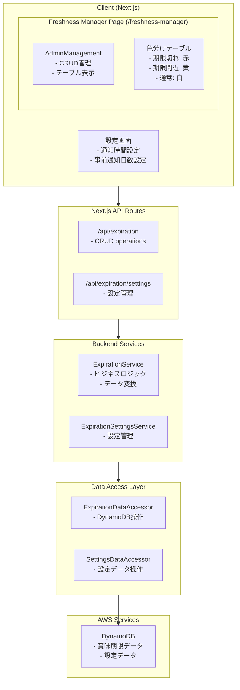
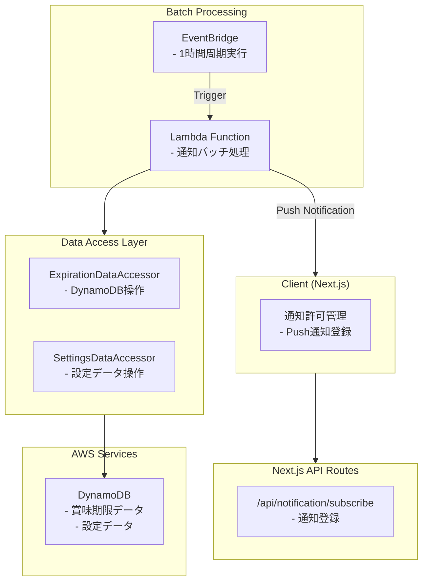
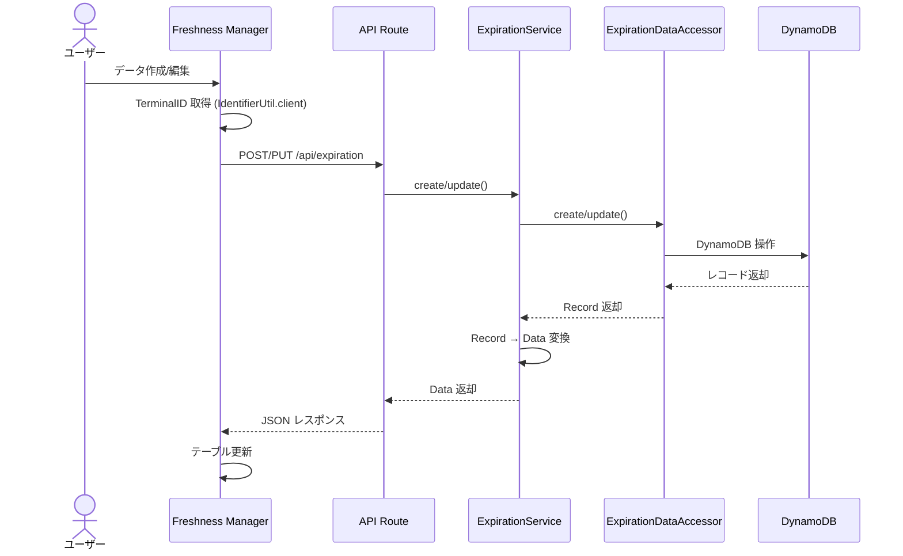
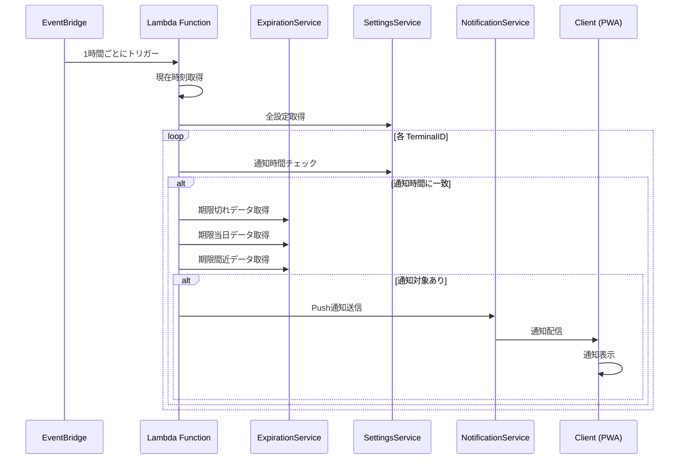
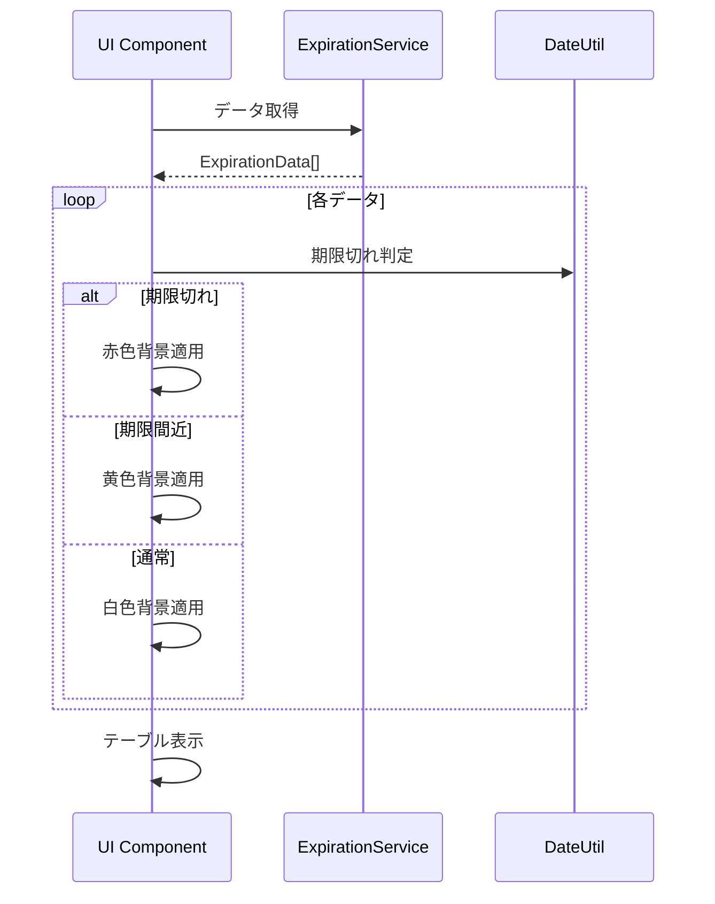

# 賞味期限管理ツール (Freshness Manager)

## 概要

賞味期限管理ツールは、食品や商品の賞味期限を TerminalID 単位で管理するためのツールです。期限切れや期限が近い商品を視覚的に把握し、通知機能により期限切れを防ぐことができます。

## アーキテクチャ

### システム構成

#### 設定管理の構成



#### 通知システムの構成



### ディレクトリ構造

```
client/tools/
├── app/
│   ├── freshness-manager/
│   │   └── page.tsx                         # 賞味期限管理ページ
│   ├── api/
│   │   └── expiration/
│   │       ├── route.ts                     # CRUD API ルート
│   │       └── settings/
│   │           └── route.ts                 # 設定 API ルート
│   └── components/
│       └── expiration/
│           ├── ExpirationManagementContainer.tsx  # メイン管理画面
│           ├── ExpirationForm.tsx           # 入力フォーム
│           └── ExpirationSettings.tsx       # 設定画面
│
tools/
├── types/
│   └── ExpirationTypes.ts                   # 型定義
├── services/
│   ├── ExpirationService.ts                 # ビジネスロジック
│   └── ExpirationSettingsService.ts         # 設定サービス
├── accessors/
│   ├── ExpirationDataAccessor.ts            # データアクセス
│   └── ExpirationSettingsAccessor.ts        # 設定データアクセス
└── consts/
    └── ExpirationConsts.ts                  # 定数定義

freshness-notification-batch/
├── handler.ts                               # Lambda ハンドラー
└── ExpirationNotificationService.ts         # 通知ロジック
```

## データモデル

### ExpirationData (Data Layer)

クライアントとビジネスロジックで使用するデータ型です。

```typescript
interface ExpirationData extends DataTypeBase {
  id: string;              // UID (自動生成)
  terminalId: string;      // TerminalID (識別子)
  title: string;           // タイトル
  expirationDate: string;  // 賞味期限 (YYYY-MM-DD形式)
  memo?: string;           // メモ (オプション)
  create: number;          // 作成日時 (Unixタイムスタンプ)
  update: number;          // 更新日時 (Unixタイムスタンプ)
}
```

### ExpirationRecord (DynamoDB Record)

DynamoDB に保存される実際のレコード型です。

```typescript
interface ExpirationRecord extends RecordTypeBase {
  ID: string;              // UID, Partition Key
  DataType: string;        // 'Expiration', Sort Key
  TerminalID: string;      // TerminalID
  Title: string;           // タイトル
  ExpirationDate: string;  // 賞味期限 (YYYY-MM-DD)
  Memo?: string;           // メモ
  Create: number;          // 作成日時
  Update: number;          // 更新日時
}
```

### ExpirationSettingsData

ユーザー設定を管理するデータ型です。

```typescript
interface ExpirationSettingsData extends DataTypeBase {
  id: string;              // UID (TerminalIDベース)
  terminalId: string;      // TerminalID
  notificationHour: number; // 通知時間 (0-23)
  daysBeforeNotify: number; // 何日前から通知するか (デフォルト: 3日)
  create: number;
  update: number;
}
```

### ExpirationSettingsRecord

設定データの DynamoDB レコード型です。

```typescript
interface ExpirationSettingsRecord extends RecordTypeBase {
  ID: string;              // UID, Partition Key
  DataType: string;        // 'ExpirationSettings', Sort Key
  TerminalID: string;      // TerminalID
  NotificationHour: number; // 通知時間
  DaysBeforeNotify: number; // 事前通知日数
  Create: number;
  Update: number;
}
```

## 主要コンポーネント

### UI コンポーネント

#### 1. ExpirationManagementContainer (クライアント)

AdminManagement コンポーネントを利用した管理画面です。

**利用するコンポーネント:**
- `nextjs-common/common/components/admin/AdminManagement.tsx`

**Props:**
```typescript
interface ExpirationManagementProps {
  terminalId: string;
}
```

**機能:**
- AdminManagement による CRUD 操作
- 賞味期限による色分け表示
- リアルタイムデータ更新

#### 2. ExpirationForm (クライアント)

賞味期限データの入力・編集フォームです。

**Props:**
```typescript
interface ExpirationFormProps {
  item: ExpirationData;
  onItemChange: (updates: ExpirationData) => void;
  loading?: boolean;
}
```

**フィールド:**
- タイトル (TextField)
- 賞味期限 (DatePicker)
- メモ (TextField, multiline)

#### 3. ExpirationSettings (クライアント)

通知設定画面です。

**設定項目:**
- 通知時間 (0-23時の選択)
- 何日前から通知するか (数値入力)
- 通知許可/拒否の切り替え

### バックエンドサービス

#### ExpirationService

賞味期限データのビジネスロジックを管理します。

**基底クラス:**
- `CRUDServiceBase<ExpirationData, ExpirationRecord>`

**主要メソッド:**
```typescript
class ExpirationService extends CRUDServiceBase<ExpirationData, ExpirationRecord> {
  // TerminalID で絞り込み取得
  async getByTerminalId(terminalId: string): Promise<ExpirationData[]>
  
  // 期限切れデータ取得
  async getExpired(terminalId: string): Promise<ExpirationData[]>
  
  // 期限間近データ取得
  async getExpiringSoon(terminalId: string, daysBeforeNotify: number): Promise<ExpirationData[]>
  
  // 期限当日データ取得
  async getExpiringToday(terminalId: string): Promise<ExpirationData[]>
  
  // Data ↔ Record 変換
  protected recordToData(record: ExpirationRecord): ExpirationData
  protected dataToRecord(data: Partial<ExpirationData>): Partial<ExpirationRecord>
}
```

#### ExpirationSettingsService

通知設定のビジネスロジックを管理します。

**基底クラス:**
- `CRUDServiceBase<ExpirationSettingsData, ExpirationSettingsRecord>`

**主要メソッド:**
```typescript
class ExpirationSettingsService extends CRUDServiceBase<ExpirationSettingsData, ExpirationSettingsRecord> {
  // TerminalID で設定取得
  async getByTerminalId(terminalId: string): Promise<ExpirationSettingsData | null>
  
  // デフォルト設定取得
  getDefaultSettings(terminalId: string): ExpirationSettingsData
}
```

### データアクセス層

#### ExpirationDataAccessor

賞味期限データの DynamoDB アクセスを提供します。

**基底クラス:**
- `DataAccessorBase<ExpirationRecord>`

```typescript
class ExpirationDataAccessor extends DataAccessorBase<ExpirationRecord> {
  constructor() {
    super(getTableName(), 'Expiration');
  }
  
  // TerminalID でフィルタリング
  async getByTerminalId(terminalId: string): Promise<ExpirationRecord[]>
}
```

#### ExpirationSettingsAccessor

設定データの DynamoDB アクセスを提供します。

**基底クラス:**
- `DataAccessorBase<ExpirationSettingsRecord>`

```typescript
class ExpirationSettingsAccessor extends DataAccessorBase<ExpirationSettingsRecord> {
  constructor() {
    super(getTableName(), 'ExpirationSettings');
  }
  
  async getByTerminalId(terminalId: string): Promise<ExpirationSettingsRecord | null>
}
```

## API 設計

### GET /api/expiration

TerminalID に紐づく賞味期限データ一覧を取得します。

**レスポンス:**
```typescript
interface GetExpirationsResponse {
  expirations: ExpirationData[];
}
```

### POST /api/expiration

新しい賞味期限データを作成します。

**リクエスト:**
```typescript
interface CreateExpirationRequest {
  title: string;
  expirationDate: string;  // YYYY-MM-DD
  memo?: string;
}
```

**レスポンス:**
```typescript
interface CreateExpirationResponse {
  expiration: ExpirationData;
}
```

### PUT /api/expiration

既存の賞味期限データを更新します。

**リクエスト:**
```typescript
interface UpdateExpirationRequest {
  id: string;
  title?: string;
  expirationDate?: string;  // YYYY-MM-DD
  memo?: string;
}
```

**レスポンス:**
```typescript
interface UpdateExpirationResponse {
  expiration: ExpirationData;
}
```

### DELETE /api/expiration

賞味期限データを削除します。

**リクエスト:**
```typescript
interface DeleteExpirationRequest {
  id: string;
}
```

**レスポンス:**
```typescript
interface DeleteExpirationResponse {
  success: boolean;
}
```

### GET /api/expiration/settings

TerminalID に紐づく設定を取得します。

**レスポンス:**
```typescript
interface GetSettingsResponse {
  settings: ExpirationSettingsData;
}
```

### PUT /api/expiration/settings

設定を更新します。

**リクエスト:**
```typescript
interface UpdateSettingsRequest {
  notificationHour?: number;  // 0-23
  daysBeforeNotify?: number;
}
```

**レスポンス:**
```typescript
interface UpdateSettingsResponse {
  settings: ExpirationSettingsData;
}
```

### DELETE /api/expiration/settings

設定を削除します。

**リクエスト:** クエリパラメータに `terminalId` を指定

**レスポンス:**
```typescript
interface DeleteSettingsResponse {
  success: boolean;
}
```

## データフロー

### CRUD 操作フロー



### 通知フロー



### 色分け表示フロー



## 通知バッチシステム

### Lambda Function 設計

#### handler.ts

```typescript
import { EventBridgeEvent } from 'aws-lambda';
import ExpirationNotificationService from './ExpirationNotificationService';

export const handler = async (event: EventBridgeEvent<string, any>) => {
  const service = new ExpirationNotificationService();
  await service.processNotifications();
};
```

#### ExpirationNotificationService

```typescript
class ExpirationNotificationService {
  private expirationService: ExpirationService;
  private settingsService: ExpirationSettingsService;
  private notificationService: NotificationService;
  
  async processNotifications(): Promise<void> {
    // 1. 現在時刻取得 (JST)
    const currentHour = this.getCurrentHourJST();
    
    // 2. 全設定取得
    const allSettings = await this.settingsService.get();
    
    // 3. 通知時間に一致する TerminalID を抽出
    const targetSettings = allSettings.filter(s => s.notificationHour === currentHour);
    
    // 4. 各 TerminalID に対して通知処理
    for (const settings of targetSettings) {
      await this.sendNotificationsForTerminal(settings);
    }
  }
  
  private async sendNotificationsForTerminal(settings: ExpirationSettingsData): Promise<void> {
    // 期限切れ、期限当日、期限間近のデータを取得
    const expired = await this.expirationService.getExpired(settings.terminalId);
    const today = await this.expirationService.getExpiringToday(settings.terminalId);
    const soon = await this.expirationService.getExpiringSoon(
      settings.terminalId,
      settings.daysBeforeNotify
    );
    
    // 通知送信
    if (expired.length > 0) {
      await this.sendNotification(settings.terminalId, 'expired', expired);
    }
    if (today.length > 0) {
      await this.sendNotification(settings.terminalId, 'today', today);
    }
    if (soon.length > 0) {
      await this.sendNotification(settings.terminalId, 'soon', soon);
    }
  }
  
  private async sendNotification(
    terminalId: string,
    type: 'expired' | 'today' | 'soon',
    items: ExpirationData[]
  ): Promise<void> {
    // TerminalID からサブスクリプション情報取得
    const subscription = await this.getSubscription(terminalId);
    
    if (!subscription) {
      return;
    }
    
    // 通知メッセージ生成
    const message = this.generateMessage(type, items);
    
    // Push通知送信
    await this.notificationService.sendPushNotification(
      '/api/notification/push',
      message,
      subscription
    );
  }
  
  private generateMessage(type: string, items: ExpirationData[]): string {
    const count = items.length;
    const titles = items.map(i => i.title).join(', ');
    
    switch (type) {
      case 'expired':
        return `期限切れ: ${count}件 - ${titles}`;
      case 'today':
        return `本日期限: ${count}件 - ${titles}`;
      case 'soon':
        return `期限間近: ${count}件 - ${titles}`;
      default:
        return '';
    }
  }
  
  private getCurrentHourJST(): number {
    // 現在のJST時刻の「時」を取得
    const now = new Date();
    const jstOffset = 9 * 60; // JST = UTC+9
    const utc = now.getTime() + (now.getTimezoneOffset() * 60000);
    const jst = new Date(utc + (jstOffset * 60000));
    return jst.getHours();
  }
}
```

### EventBridge 設定

**トリガー設定:**
- スケジュール式: `rate(1 hour)` (1時間ごと)

**環境変数:**
- `TABLE_NAME`: DynamoDB テーブル名
- `NOTIFICATION_ENDPOINT`: 通知エンドポイント

## 機能仕様

### 基本機能

#### 1. 賞味期限管理 (CRUD)

- **作成**: タイトル、期限、メモを入力して作成
- **一覧表示**: AdminManagement による統一された管理画面
- **編集**: 既存データの更新
- **削除**: データの削除（期限切れでも残る）

#### 2. 色分け表示

- **赤色背景**: 賞味期限が切れたデータ
- **黄色背景**: 賞味期限が設定日数前に近づいたデータ
- **白色背景**: 通常のデータ

#### 3. 設定機能

- **通知時間設定**: 0-23時の中から通知を受け取る時間を設定
- **事前通知日数**: 何日前から「期限間近」として通知するか設定
- **デフォルト値**: 
  - 通知時間: 9時
  - 事前通知日数: 3日

#### 4. 通知機能

- **Push通知**: PWA の Push API を利用
- **通知種類**:
  - 期限切れ通知
  - 期限当日通知
  - 期限間近通知（設定日数前）
- **通知頻度**: 1日1回（設定した時刻）
- **通知内容**: 該当する商品のタイトルと件数

### IdentifierUtil による識別

#### クライアント側

```typescript
import IdentifierUtil from '@client-common/utils/IdentifierUtil.client';

// TerminalID または UserID を取得
const identifier = await IdentifierUtil.getIdentifier();

// TerminalID のみ取得
const terminalId = await IdentifierUtil.getTerminalId();
```

#### サーバー側

```typescript
import IdentifierUtil from '@client-common/utils/IdentifierUtil.server';

// UserID を取得 (ログインしていない場合は null)
const userId = await IdentifierUtil.getIdentifier();

// null の場合は、クライアント側で TerminalID を使用
```

### AdminManagement による管理画面

```typescript
import AdminManagement from '@client-common/components/admin/AdminManagement';
import { ExpirationData } from '@tools/types/ExpirationTypes';

<AdminManagement<ExpirationData>
  columns={columns}
  fetchData={fetchExpirations}
  itemName="Expiration"
  defaultItem={defaultExpiration}
  validateItem={validateExpiration}
  onCreate={handleCreate}
  onUpdate={handleUpdate}
  onDelete={handleDelete}
>
  {(item, state, onItemChange, onStateChange, loading) => (
    <ExpirationForm
      item={item}
      onItemChange={onItemChange}
      loading={loading}
    />
  )}
</AdminManagement>
```

## 技術仕様

### フロントエンド

**フレームワーク:**
- Next.js 14+ (App Router)
- React 18+
- TypeScript

**UI ライブラリ:**
- Material-UI (@mui/material)
- nextjs-common コンポーネント

**日付処理:**
- dayjs (JST タイムゾーン対応)

**状態管理:**
- React Hooks
- AdminManagement 内部状態管理

### バックエンド

**サーバーレス:**
- AWS Lambda (Node.js runtime)
- EventBridge (1時間周期トリガー)

**データベース:**
- AWS DynamoDB
  - テーブル名: `Tools` または `DevTools` (環境依存)
  - Partition Key: `ID` (UID)
  - Sort Key: `DataType` ('Expiration' または 'ExpirationSettings')

**データアクセス:**
- `DataAccessorBase` 継承
- `CRUDServiceBase` 継承

**通知:**
- NotificationService (Push API)
- Web Push Protocol

### DynamoDB テーブル設計

**GSI (Global Secondary Index) - TerminalID検索用 (今後の課題):**

> **Note**: GSI は今後の課題とし、現時点では実装しません。当面は Scan 操作でデータを取得します。

```
IndexName: TerminalID-DataType-index
Partition Key: TerminalID
Sort Key: DataType
```

**データ例:**
```json
{
  "ID": "uuid-1234",
  "DataType": "Expiration",
  "TerminalID": "terminal-5678",
  "Title": "牛乳",
  "ExpirationDate": "2024-10-20",
  "Memo": "開封済み",
  "Create": 1697000000,
  "Update": 1697000000
}
```

### 環境別設定

**テーブル名取得:**
```typescript
import EnvironmentalUtil from '@common/utils/EnvironmentalUtil';

function getTableName(): string {
  const env = EnvironmentalUtil.GetProcessEnv();
  return env === 'production' ? 'Tools' : 'DevTools';
}
```

## セキュリティ

### 認証・認可

- **識別**: TerminalID ベース（ログイン不要）
- **データ分離**: TerminalID ごとにデータを分離
- **アクセス制御**: 自分の TerminalID のデータのみアクセス可能

### データ保護

- **入力検証**: 
  - タイトル: 必須、最大100文字
  - 賞味期限: YYYY-MM-DD 形式、必須
  - メモ: オプション、最大500文字
- **XSS 対策**: ユーザー入力のサニタイズ
- **DynamoDB セキュリティ**: IAM ロールによるアクセス制限

### 通知セキュリティ

- **サブスクリプション管理**: TerminalID と紐付け
- **認証**: Push API の認証キー使用
- **プライバシー**: 通知内容は商品タイトルのみ（詳細なし）

## パフォーマンス最適化

### フロントエンド

- **仮想スクロール**: 大量データ表示時
- **メモ化**: React.memo、useMemo の活用
- **遅延ロード**: 設定画面など

### バックエンド

- **キャッシュ**: CRUDServiceBase のキャッシュ機能利用
- **バッチ処理**: DynamoDB バッチ操作
- **インデックス**: TerminalID-DataType GSI による高速検索

### Lambda 最適化

- **コールドスタート対策**: 
  - 最小限の依存関係
  - 共通処理の事前初期化
- **並行実行制限**: EventBridge による制御
- **タイムアウト**: 適切なタイムアウト設定（5分）

## 制約事項

### 現時点の制限

- ログイン機能なし（TerminalID ベース）
- 画像添付非対応
- カテゴリ分類非対応
- 一括編集非対応
- エクスポート/インポート非対応

### 通知の制限

- PWA インストール必須
- ブラウザの通知許可必須
- 1日1回の通知のみ
- インターネット接続必須

## 使用方法

### アクセス方法

- ホーム画面の「Freshness Manager」ボタンから
- メニューの「Freshness Manager」リンクから
- 直接URL: `/freshness-manager`

### 基本的な使い方

1. **賞味期限の登録**
   - 「Create」ボタンをクリック
   - タイトル、賞味期限、メモを入力
   - 「Save」ボタンで保存

2. **一覧表示と色分け**
   - 登録した賞味期限が一覧表示される
   - 期限切れは赤色、期限間近は黄色で表示

3. **編集・削除**
   - 「Edit」ボタンで編集
   - 「Delete」ボタンで削除

4. **通知設定**
   - 設定画面で通知時間と事前通知日数を設定
   - 通知を有効化

### 通知の受け取り方

1. **初回設定**
   - ブラウザの通知許可を有効化
   - PWA をインストール（推奨）
   - 設定画面で通知時間を設定

2. **通知受信**
   - 設定した時刻に自動的に通知が届く
   - 期限切れ、期限当日、期限間近の3種類

## テスト戦略

### ユニットテスト

- ExpirationService のテスト
- ExpirationDataAccessor のテスト
- 日付判定ロジックのテスト
- データ変換 (Data ↔ Record) のテスト

### 統合テスト

- API Route のテスト
- DynamoDB 統合テスト
- 通知バッチ処理のテスト

### E2E テスト (今後の課題)

> **Note**: E2E テストは今後の課題とし、現時点では考慮しません。

- CRUD フロー
- 色分け表示
- 通知設定フロー

## ロードマップ

### Phase 1: 基本機能実装

- [x] データモデル設計
- [x] DynamoDB テーブル設計
- [x] DataAccessor 実装
- [x] Service 実装
- [x] API Routes 実装
- [ ] UI コンポーネント実装
- [ ] AdminManagement 統合
- [ ] 色分け表示実装

### Phase 2: 通知機能実装

- [ ] 設定画面実装
- [ ] Push通知登録
- [ ] Lambda Function 実装
- [ ] EventBridge 設定
- [ ] 通知バッチ処理実装

### Phase 3: 機能拡張

- [ ] カテゴリ分類
- [ ] 画像添付
- [ ] 一括編集
- [ ] エクスポート/インポート
- [ ] 統計・分析機能

### Phase 4: 高度な機能

- [ ] バーコード読み取り
- [ ] OCR による期限自動認識
- [ ] AI による消費提案
- [ ] レシピ連携

## 関連ドキュメント

- [Common Module Documentation](../common/README.md)
- [Common Client Documentation](../common/client/README.md)
- [Common Server Documentation](../common/server/README.md)
- [AI Chat Tool](./ai-chat.md)
- [Splatoon3 Gear Tool](./splatoon-gear.md)
- [Convert Transfer Tool](./convert-transfer.md)
- [AWS DynamoDB Documentation](https://docs.aws.amazon.com/dynamodb/)
- [AWS Lambda Documentation](https://docs.aws.amazon.com/lambda/)
- [Web Push API Documentation](https://developer.mozilla.org/en-US/docs/Web/API/Push_API)
