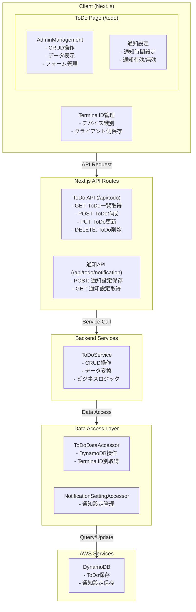
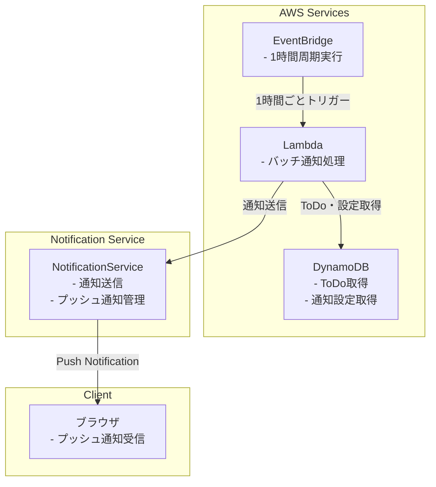
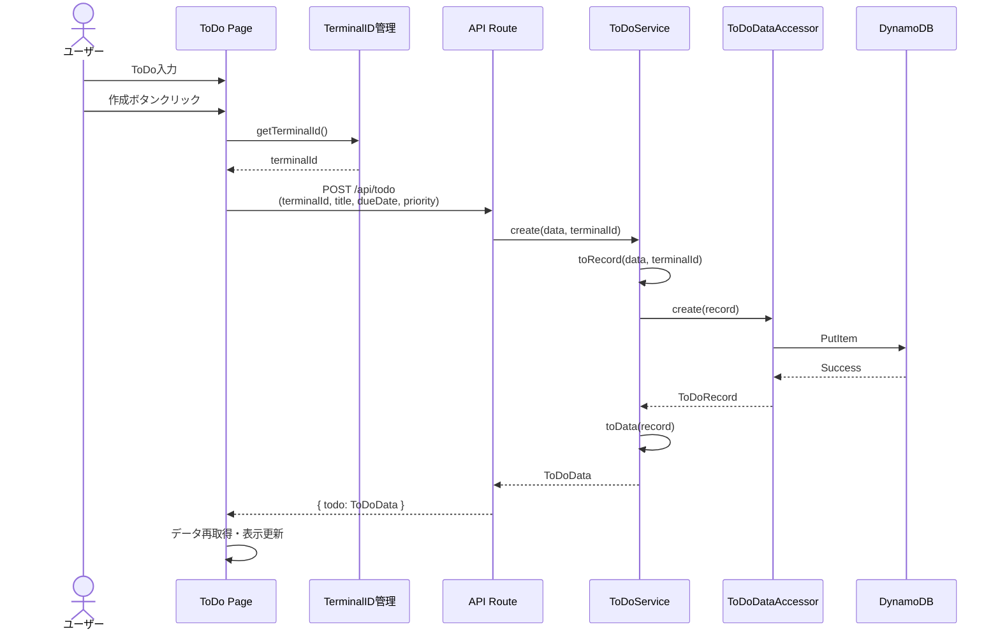
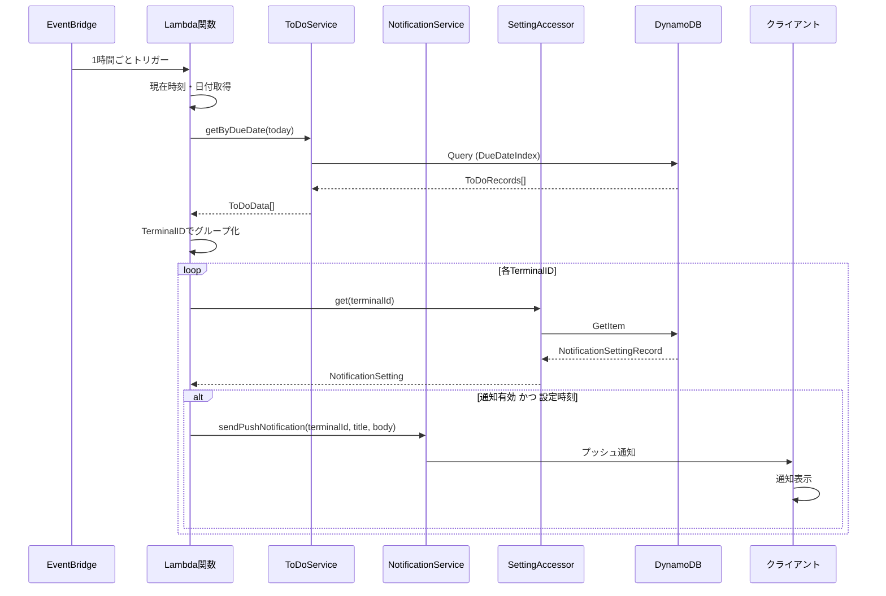
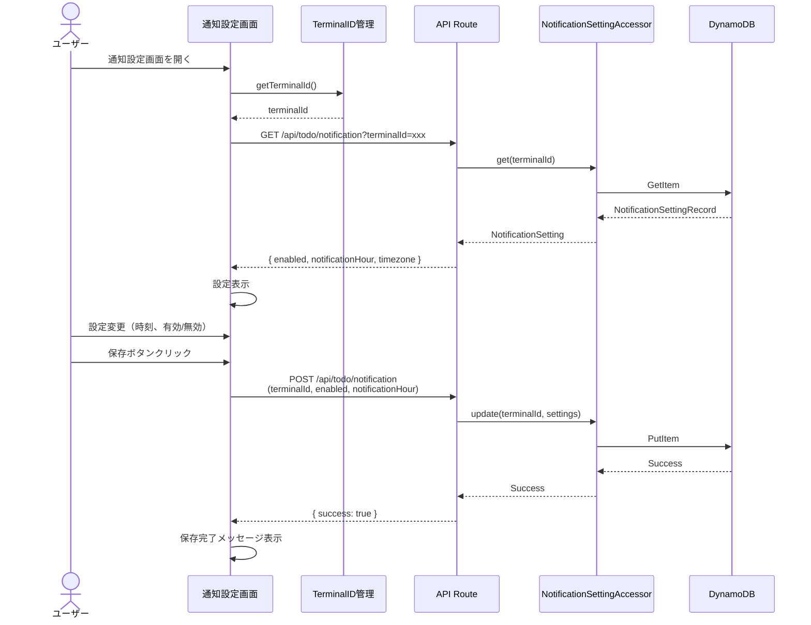

# ToDo Tool

## 概要

TerminalID ベースの ToDo 管理ツールです。ユーザー認証なしで、各デバイス（TerminalID）ごとに ToDo を管理し、期日に基づいた通知機能を提供します。

## アーキテクチャ

### システム構成

#### データ登録系



#### バッチ処理系



### ディレクトリ構造

```
client/tools/
├── app/
│   ├── todo/
│   │   └── page.tsx                     # ToDo管理ページ
│   ├── api/
│   │   └── todo/
│   │       ├── route.ts                 # CRUD API
│   │       └── notification/
│   │           └── route.ts             # 通知設定API
│   └── components/
│       └── todo/
│           ├── ToDoForm.tsx             # ToDo入力フォーム
│           └── NotificationSettings.tsx # 通知設定コンポーネント

tools/
├── services/
│   ├── ToDoService.ts                   # ToDoビジネスロジック
│   ├── ToDoDataAccessor.ts              # ToDoデータアクセス
│   └── NotificationSettingAccessor.ts   # 通知設定アクセス
└── interfaces/
    └── ToDoType.ts                      # ToDoインターフェース

todo-notification-batch/
└── index.ts                             # バッチ通知Lambda
```

## データモデル

### DynamoDB テーブル設計

#### テーブル名
- 本番環境: `Tools`
- 開発環境・ローカル環境: `DevTools`

#### ToDoレコード

```typescript
// 優先度の定義
const PRIORITY_LEVELS = ['Must', 'Should', 'Could'] as const;
type PriorityType = typeof PRIORITY_LEVELS[number];

interface ToDoRecord extends RecordTypeBase {
  ID: string;                    // PK: UUID（ToDo固有のID）
  DataType: string;              // SK: "ToDo"
  TerminalID: string;            // TerminalID（デバイス識別子）
  Title: string;                 // ToDoタイトル
  DueDate: string;               // 期日 (YYYY-MM-DD形式)
  Priority: PriorityType;        // 優先度
  Create: number;                // 作成日時 (Unixタイムスタンプ)
  Update: number;                // 更新日時 (Unixタイムスタンプ)
}
```

#### NotificationSettingレコード

```typescript
interface NotificationSettingRecord extends RecordTypeBase {
  ID: string;                    // PK: TerminalID（通知設定の識別にTerminalIDを使用）
  DataType: string;              // SK: "NotificationSetting"
  TerminalID: string;            // TerminalID（IDと同じ値）
  Enabled: boolean;              // 通知有効/無効
  NotificationHour: number;      // 通知時間 (0-23)
  Timezone: string;              // タイムゾーン (例: "Asia/Tokyo")
  Create: number;                // 作成日時 (Unixタイムスタンプ)
  Update: number;                // 更新日時 (Unixタイムスタンプ)
}
```

### GSI (Global Secondary Index)

GSIは必須ではありませんが、今後のパフォーマンス向上のために以下のような設計が考えられます。

#### TerminalID-DataType-Index（任意）
- **PK**: TerminalID
- **SK**: DataType
- **用途**: TerminalIDごとのデータ取得を効率化

#### DueDate-Index（任意）
- **PK**: DueDate
- **SK**: ID (ToDoのUUID)
- **用途**: バッチ処理で特定日付のToDoを効率的に取得

## API 設計

### ToDo CRUD API

#### GET /api/todo
ToDoリストを取得します。

**クエリパラメータ:**
```typescript
{
  terminalId: string;  // 必須: TerminalID
}
```

**レスポンス:**
```typescript
{
  todos: ToDoData[];
}

interface ToDoData {
  id: string;
  terminalId: string;  // TerminalID（フロントエンドで必要）
  title: string;
  dueDate: string;
  priority: PriorityType;  // 'Must' | 'Should' | 'Could'
  createdAt: string;
  updatedAt: string;
}
```

#### POST /api/todo
新しいToDoを作成します。

**リクエストボディ:**
```typescript
{
  terminalId: string;
  title: string;
  dueDate: string;
  priority: PriorityType;  // 'Must' | 'Should' | 'Could'
}
```

**レスポンス:**
```typescript
{
  todo: ToDoData;
}
```

#### PUT /api/todo
ToDoを更新します。

**リクエストボディ:**
```typescript
{
  id: string;
  terminalId: string;
  title: string;
  dueDate: string;
  priority: PriorityType;  // 'Must' | 'Should' | 'Could'
}
```

**レスポンス:**
```typescript
{
  todo: ToDoData;
}
```

#### DELETE /api/todo
ToDoを削除します。

**リクエストボディ:**
```typescript
{
  id: string;
  terminalId: string;
}
```

**レスポンス:**
```typescript
{
  success: boolean;
}
```

### 通知設定 API

#### GET /api/todo/notification
通知設定を取得します。

**クエリパラメータ:**
```typescript
{
  terminalId: string;  // 必須: TerminalID
}
```

**レスポンス:**
```typescript
{
  enabled: boolean;
  notificationHour: number;
  timezone: string;
}
```

#### POST /api/todo/notification
通知設定を保存します。

**リクエストボディ:**
```typescript
{
  terminalId: string;
  enabled: boolean;
  notificationHour: number;  // 0-23
  timezone?: string;         // 省略時はデフォルト "Asia/Tokyo"
}
```

**レスポンス:**
```typescript
{
  success: boolean;
}
```

## 主要コンポーネント

### フロントエンド

#### 1. AdminManagement (nextjs-common)

ToDo管理のメインコンポーネントです。

**利用するコンポーネント:**
- `nextjs-common/common/components/admin/AdminManagement.tsx`

**Props:**
```typescript
interface AdminManagementProps<T> {
  dataSource: T[];                    // データソース
  columns: ColumnDefinition<T>[];     // 列定義
  onAdd?: (data: T) => Promise<void>; // 追加ハンドラ
  onEdit?: (data: T) => Promise<void>;// 編集ハンドラ
  onDelete?: (id: string) => Promise<void>; // 削除ハンドラ
  formFields: FormFieldDefinition[];  // フォーム項目定義
}
```

**使用例:**
```typescript
<AdminManagement
  dataSource={todos}
  columns={todoColumns}
  onAdd={handleAddTodo}
  onEdit={handleEditTodo}
  onDelete={handleDeleteTodo}
  formFields={todoFormFields}
/>
```

#### 2. TerminalID 管理 (nextjs-common)

デバイスを識別するためのユーティリティです。

**利用するユーティリティ:**
- `nextjs-common/common/utils/IdentifierUtil.client.ts`
- `nextjs-common/common/utils/IdentifierUtil.server.ts`

**機能:**
- クライアント側でTerminalIDを生成・保存
- ローカルストレージに永続化
- サーバー側での検証

**使用例（クライアント）:**
```typescript
import IdentifierUtil from '@nextjs-common/common/utils/IdentifierUtil.client';

// TerminalIDの取得（存在しない場合は生成）
const terminalId = IdentifierUtil.getOrCreateTerminalId();
```

**使用例（サーバー）:**
```typescript
import IdentifierUtil from '@typescript-common/common/utils/IdentifierUtil.server';

// TerminalIDの検証
const isValid = IdentifierUtil.validateTerminalId(terminalId);
```

### バックエンドサービス

#### 1. ToDoDataAccessor (tools)

ToDoのデータアクセスを担当します。

**配置場所:**
- `tools/services/ToDoDataAccessor.ts`

**基底クラス:**
- `DataAccessorBase<ToDoRecord>`

**主要メソッド:**
```typescript
class ToDoDataAccessor extends DataAccessorBase<ToDoRecord> {
  constructor() {
    super(getTableName(), 'ToDo');
  }

  // TerminalID別のToDo取得
  async getByTerminalId(terminalId: string): Promise<ToDoRecord[]> {
    // TerminalID-DataType-Index を使用してクエリ（GSI利用時）
    // または全件取得後フィルター
    const allRecords = await this.get();
    return allRecords.filter(record => record.TerminalID === terminalId);
  }

  // 期日別のToDo取得（バッチ用）
  async getByDueDate(dueDate: string): Promise<ToDoRecord[]> {
    // DueDateインデックスを使用（GSI利用時）
    // または全件取得後フィルター
    const allRecords = await this.get();
    return allRecords.filter(record => record.DueDate === dueDate);
  }
}
```

#### 2. ToDoService (tools)

ToDoのビジネスロジックを担当します。

**配置場所:**
- `tools/services/ToDoService.ts`

**基底クラス:**
- `CRUDServiceBase<ToDoData, ToDoRecord>`

**主要メソッド:**
```typescript
class ToDoService extends CRUDServiceBase<ToDoData, ToDoRecord> {
  constructor() {
    super(new ToDoDataAccessor());
  }

  // Data → Record 変換
  protected toRecord(data: ToDoData, terminalId: string): ToDoRecord {
    const now = Date.now();
    return {
      ID: data.id || generateUUID(),
      DataType: 'ToDo',
      TerminalID: terminalId,
      Title: data.title,
      DueDate: data.dueDate,
      Priority: data.priority,
      Create: data.createdAt ? new Date(data.createdAt).getTime() : now,
      Update: now,
    };
  }

  // Record → Data 変換
  protected toData(record: ToDoRecord): ToDoData {
    return {
      id: record.ID,
      terminalId: record.TerminalID,  // TerminalIDも含める
      title: record.Title,
      dueDate: record.DueDate,
      priority: record.Priority,
      createdAt: new Date(record.Create).toISOString(),
      updatedAt: new Date(record.Update).toISOString(),
    };
  }

  // TerminalID別取得
  async getByTerminalId(terminalId: string): Promise<ToDoData[]> {
    const records = await this.accessor.getByTerminalId(terminalId);
    return records.map(r => this.toData(r));
  }
}
```

#### 3. NotificationService (typescript-common)

通知機能を担当します。

**利用するユーティリティ:**
- `typescript-common/common/utils/NotificationUtil.ts`

**主要メソッド:**
```typescript
class NotificationService {
  // プッシュ通知送信
  async sendPushNotification(
    terminalId: string,
    title: string,
    body: string
  ): Promise<void> {
    await NotificationUtil.sendPush({
      terminalId,
      title,
      body,
      icon: '/logo.png',
    });
  }

  // ToDo通知送信
  async notifyTodo(todo: ToDoData, terminalId: string): Promise<void> {
    const title = 'ToDo通知';
    const body = `【${todo.priority}】${todo.title} (期日: ${todo.dueDate})`;
    await this.sendPushNotification(terminalId, title, body);
  }
}
```

## 通知システム

### プッシュ通知の仕組み

#### 1. サービスワーカー登録

クライアント側でサービスワーカーを登録し、プッシュ通知を受信可能にします。

```typescript
// ページ読み込み時
if ('serviceWorker' in navigator && 'PushManager' in window) {
  // サービスワーカー登録
  const registration = await navigator.serviceWorker.register('/sw.js');
  
  // プッシュ通知の許可リクエスト
  const permission = await Notification.requestPermission();
  
  if (permission === 'granted') {
    // プッシュ購読
    const subscription = await registration.pushManager.subscribe({
      userVisibleOnly: true,
      applicationServerKey: vapidPublicKey
    });
    
    // 購読情報をサーバーに保存
    await saveSubscription(terminalId, subscription);
  }
}
```

#### 2. サービスワーカー実装

プッシュイベントを処理します（既存の `sw.js` を使用）。

```javascript
// /client/tools/public/sw.js
self.addEventListener('push', function (event) {
  if (event.data) {
    const data = event.data.json();
    const options = {
      body: data.body,
      icon: data.icon || '/logo.png',
      badge: '/logo.png',
      vibrate: [100, 50, 100],
    };

    event.waitUntil(
      self.registration.showNotification(data.title, options)
    );
  }
});
```

### バッチ通知処理

#### Lambda関数設計

**トリガー:** EventBridge (1時間周期)

**処理フロー:**
```typescript
// todo-notification-batch/index.ts
import { Handler } from 'aws-lambda';
import ToDoService from '@tools/services/ToDoService';
import NotificationService from '@typescript-common/common/services/NotificationService';
import NotificationSettingAccessor from '@tools/services/NotificationSettingAccessor';
import DateUtil from '@typescript-common/common/utils/DateUtil';

export const handler: Handler = async (event) => {
  try {
    const todoService = new ToDoService();
    const notificationService = new NotificationService();
    const notificationSettingAccessor = new NotificationSettingAccessor();
    
    // 現在日時を取得
    const now = new Date();
    const currentHour = now.getHours();
    const today = DateUtil.format(now, 'YYYY-MM-DD');
    
    // 今日が期日のToDoを取得
    const todosToday = await todoService.getByDueDate(today);
    
    // TerminalIDごとにグループ化
    const todosByTerminal = groupByTerminalId(todosToday);
    
    // 各TerminalIDの通知設定を確認
    for (const [terminalId, todos] of todosByTerminal) {
      const settings = await notificationSettingAccessor.get(terminalId);
      
      // 通知有効 かつ 設定された時刻の場合
      if (settings.Enabled && settings.NotificationHour === currentHour) {
        // 複数ToDoがある場合はまとめて通知
        const todoTitles = todos.map(t => `- ${t.title}`).join('\n');
        await notificationService.sendPushNotification(
          terminalId,
          `本日のToDo (${todos.length}件)`,
          todoTitles
        );
      }
    }
    
    return { statusCode: 200, body: 'Success' };
  } catch (error) {
    console.error('Batch notification error:', error);
    return { statusCode: 500, body: 'Error' };
  }
};

function groupByTerminalId(todos: ToDoData[]): Map<string, ToDoData[]> {
  const grouped = new Map<string, ToDoData[]>();
  
  for (const todo of todos) {
    const terminalTodos = grouped.get(todo.terminalId) || [];
    terminalTodos.push(todo);
    grouped.set(todo.terminalId, terminalTodos);
  }
  
  return grouped;
}
```

#### EventBridge設定

```yaml
# CloudFormation/SAM テンプレート例
ToDoNotificationSchedule:
  Type: AWS::Events::Rule
  Properties:
    Description: "Trigger ToDo notification every hour"
    ScheduleExpression: "rate(1 hour)"
    State: ENABLED
    Targets:
      - Arn: !GetAtt ToDoNotificationFunction.Arn
        Id: ToDoNotificationTarget
```

## データフロー

### ToDo作成フロー



### 通知送信フロー



### 通知設定フロー



## TerminalID識別方式

### クライアント側

TerminalIDはブラウザのローカルストレージに保存され、デバイスを識別します。

```typescript
// nextjs-common/common/utils/IdentifierUtil.client.ts の使用
import IdentifierUtil from '@nextjs-common/common/utils/IdentifierUtil.client';

// TerminalIDの取得または生成
const terminalId = IdentifierUtil.getOrCreateTerminalId();

// 実装イメージ:
// 1. ローカルストレージから 'terminalId' を取得
// 2. 存在しない場合、UUID v4 を生成して保存
// 3. 返却
```

### サーバー側

TerminalIDの形式検証を行います。

```typescript
// nextjs-common/common/utils/IdentifierUtil.server.ts の使用
import IdentifierUtil from '@typescript-common/common/utils/IdentifierUtil.server';

// TerminalIDのバリデーション
const isValid = IdentifierUtil.validateTerminalId(terminalId);
if (!isValid) {
  throw new Error('Invalid TerminalID');
}

// 実装イメージ:
// UUID v4 形式の検証
// 長さ、文字種、ハイフン位置のチェック
```

## UI/UX設計

### ToDoページレイアウト

```
┌─────────────────────────────────────────────┐
│  ToDo 管理                          [+新規]  │
├─────────────────────────────────────────────┤
│                                             │
│  ┌────────────────────────────────────┐    │
│  │ AdminManagement コンポーネント      │    │
│  │                                    │    │
│  │  タイトル  期日      優先度  操作  │    │
│  │  ─────────────────────────────────  │    │
│  │  □ 報告書作成  2024-10-20  Must  [編集][削除] │
│  │  □ 会議準備    2024-10-18  Should [編集][削除] │
│  │  □ メール返信  2024-10-19  Could  [編集][削除] │
│  │                                    │    │
│  └────────────────────────────────────┘    │
│                                             │
│  ┌─ 通知設定 ──────────────────────┐        │
│  │  ☑ 通知を有効にする              │        │
│  │  通知時間: [09:00 ▼]            │        │
│  │  タイムゾーン: Asia/Tokyo        │        │
│  │                        [保存]    │        │
│  └─────────────────────────────────┘        │
└─────────────────────────────────────────────┘
```

### フォーム項目定義

```typescript
const todoFormFields: FormFieldDefinition[] = [
  {
    name: 'title',
    label: 'タイトル',
    type: 'text',
    required: true,
    placeholder: 'ToDoのタイトルを入力',
  },
  {
    name: 'dueDate',
    label: '期日',
    type: 'date',
    required: true,
  },
  {
    name: 'priority',
    label: '優先度',
    type: 'select',
    required: true,
    options: [
      { value: 'Must', label: 'Must（必須）' },
      { value: 'Should', label: 'Should（推奨）' },
      { value: 'Could', label: 'Could（可能なら）' },
    ],
  },
];
```

### 列定義

```typescript
const todoColumns: ColumnDefinition<ToDoData>[] = [
  {
    field: 'title',
    headerName: 'タイトル',
    width: 300,
  },
  {
    field: 'dueDate',
    headerName: '期日',
    width: 150,
    valueFormatter: (value) => DateUtil.format(value, 'YYYY年MM月DD日'),
  },
  {
    field: 'priority',
    headerName: '優先度',
    width: 120,
    cellRenderer: (value) => {
      const colors = {
        Must: 'error',
        Should: 'warning',
        Could: 'info',
      };
      return <Chip label={value} color={colors[value]} size="small" />;
    },
  },
];
```

## 環境設定

### 環境設定

```typescript
import EnvironmentalUtil from '@typescript-common/common/utils/EnvironmentalUtil';

function getTableName(): string {
  const env = EnvironmentalUtil.GetProcessEnv();
  switch (env) {
    case 'production':
      return 'Tools';
    default:  // development, local
      return 'DevTools';
  }
}
```

### シークレット管理

通知機能に必要なVAPID鍵などはSecrets Managerで管理します。

```typescript
import SecretsManagerUtil from '@typescript-common/common/aws/SecretsManagerUtil';
import EnvironmentalUtil from '@typescript-common/common/utils/EnvironmentalUtil';

const env = EnvironmentalUtil.GetProcessEnv();
const secretName = env === 'production' ? 'Tools' : 'DevTools';

// VAPID公開鍵の取得
const vapidPublicKey = await SecretsManagerUtil.getSecretValue(
  secretName,
  'VAPID_PUBLIC_KEY'
);

// VAPID秘密鍵の取得（サーバー側のみ）
const vapidPrivateKey = await SecretsManagerUtil.getSecretValue(
  secretName,
  'VAPID_PRIVATE_KEY'
);
```

## 技術仕様

### フロントエンド

**フレームワーク:**
- Next.js 14+ (App Router)
- React 18+
- TypeScript

**UI ライブラリ:**
- Material-UI (@mui/material)
- nextjs-common コンポーネント
  - AdminManagement
  - IdentifierUtil (client)

**状態管理:**
- React Hooks (useState, useEffect)
- ローカルストレージ（TerminalID保存）

### バックエンド

**API:**
- Next.js API Routes
- RESTful API 設計

**データアクセス:**
- typescript-common/DataAccessorBase
- typescript-common/CRUDServiceBase
- DynamoDBUtil

**ユーティリティ:**
- typescript-common/DateUtil
- typescript-common/TimeUtil
- typescript-common/NotificationUtil
- typescript-common/IdentifierUtil (server)

### バッチ処理

**実行環境:**
- AWS Lambda (Node.js 18.x+)

**トリガー:**
- EventBridge (1時間周期)

**処理内容:**
- 期日が今日のToDo取得
- 通知設定確認
- プッシュ通知送信

### データストア

**Database:**
- DynamoDB

**テーブル:**
- 本番: Tools
- 開発: DevTools
- ローカル: LocalTools

**GSI:**
- TerminalID-DataType-Index
- DueDate-Index

### 通知

**プッシュ通知:**
- Web Push API
- Service Worker
- VAPID認証

**通知設定:**
- 時刻指定 (0-23時)
- 有効/無効切り替え
- タイムゾーン対応

## セキュリティ

### TerminalID管理
- クライアント側でUUID生成
- ローカルストレージに保存
- サーバー側で形式検証
- 認証なし（TerminalIDベース）

### データアクセス制限
- TerminalIDによるデータ分離
- 他のTerminalIDのデータへのアクセス不可
- API レベルでのTerminalID検証

### 通知セキュリティ
- VAPID認証によるプッシュ通知
- シークレットキーの安全な管理（Secrets Manager）
- クライアント側での通知許可制御

## 使用方法

### アクセス方法

- ホーム画面の「ToDo」ボタンから
- メニューの「ToDo」リンクから
- 直接URL: `/todo`

### 基本的な使い方

#### ToDo作成
1. ToDo ページを開く
2. 「新規」ボタンをクリック
3. フォームにタイトル、期日、優先度を入力
4. 「保存」ボタンをクリック
5. ToDo一覧に追加される

#### ToDo編集
1. 一覧から編集したいToDoの「編集」ボタンをクリック
2. フォームで内容を変更
3. 「保存」ボタンをクリック
4. 一覧が更新される

#### ToDo削除
1. 一覧から削除したいToDoの「削除」ボタンをクリック
2. 確認ダイアログで「OK」
3. ToDoが削除される

#### 通知設定
1. 通知設定セクションを開く
2. 「通知を有効にする」をチェック
3. 通知時間を選択（0-23時）
4. 「保存」ボタンをクリック
5. 設定が保存される

### 通知の仕組み

1. **初回アクセス時**
   - ブラウザに通知許可をリクエスト
   - 許可された場合、プッシュ通知を購読

2. **通知受信**
   - バッチ処理が1時間ごとに実行
   - 今日が期日のToDoがある場合
   - 設定した時刻に通知が送信される

3. **通知内容**
   - タイトル: 「本日のToDo (件数)」
   - 本文: ToDoのタイトル一覧

## 制約事項

### 現時点の制限

- ログイン機能なし（TerminalIDベース）
- 複数デバイス間の同期なし
- ToDoの共有機能なし
- リマインダー機能なし（通知は1日1回のみ）
- 繰り返しタスク非対応
- サブタスク非対応
- タグ・カテゴリ機能なし
- 添付ファイル非対応

### データ制限

- ToDoは削除運用（完了機能なし）
- 期日は年月日のみ（時刻指定なし）
- 優先度は3段階固定（Must/Should/Could）

### 通知制限

- 通知時刻は時間単位（分単位の指定不可）
- 1日1回の通知のみ
- 複数回の通知設定不可
- 通知はプッシュ通知のみ（メール通知なし）

## ロードマップ

### Phase 1: 基本機能実装 (v1.0)

- [x] アーキテクチャ設計
- [x] データモデル定義
- [x] ToDoDataAccessor実装
- [x] ToDoService実装
- [x] API実装（CRUD）
- [x] フロントエンド実装
  - [x] ToDoページ作成
  - [x] AdminManagement統合
  - [x] TerminalID管理統合
- [x] 通知設定機能
  - [x] NotificationSettingAccessor実装
  - [x] 通知設定API実装
  - [x] 通知設定UI実装
- [x] プッシュ通知機能
  - [x] サービスワーカー実装
  - [x] プッシュ購読管理
  - [x] NotificationService実装
- [x] バッチ通知処理
  - [x] Lambda関数実装
  - [ ] EventBridge設定
  - [ ] DueDate GSI作成

### Phase 2: 機能拡張 (v1.1)

- [ ] ToDo完了機能
  - [ ] 完了フラグ追加
  - [ ] 完了済みToDoの表示切り替え
  - [ ] 完了日時記録
- [ ] フィルター・ソート機能
  - [ ] 優先度フィルター
  - [ ] 期日フィルター
  - [ ] ソート機能（期日、優先度、作成日時）
- [ ] 検索機能
  - [ ] タイトル検索
  - [ ] 全文検索

### Phase 3: 高度な機能 (v1.2)

- [ ] リマインダー機能
  - [ ] 複数回通知設定
  - [ ] 事前通知（1日前、3日前など）
  - [ ] カスタム通知時刻
- [ ] 繰り返しタスク
  - [ ] 日次/週次/月次タスク
  - [ ] カスタム繰り返しパターン
- [ ] サブタスク機能
  - [ ] 親子関係管理
  - [ ] 進捗率表示
- [ ] タグ・カテゴリ
  - [ ] タグ付け機能
  - [ ] カテゴリ分類
  - [ ] タグ・カテゴリフィルター

### Phase 4: マルチデバイス対応 (v2.0)

- [ ] ユーザー認証統合
  - [ ] 複数デバイスでの同期
  - [ ] ログイン機能
- [ ] データ同期
  - [ ] リアルタイム同期
  - [ ] オフライン対応
- [ ] 共有機能
  - [ ] ToDoの共有
  - [ ] コラボレーション

## テスト戦略

### ユニットテスト

- ToDoDataAccessor のテスト
- ToDoService のテスト
- NotificationService のテスト
- ユーティリティ関数のテスト

### 統合テスト

- API エンドポイントのテスト
- DynamoDB との統合テスト
- プッシュ通知のテスト

## パフォーマンス最適化

### フロントエンド

- AdminManagement のメモ化
- ToDoリストの仮想スクロール（大量データ対応）
- ローカルストレージキャッシュ

### バックエンド

- バッチ処理の効率化（並列処理）
- API レスポンスのキャッシュ

## 関連ドキュメント

- [Common Module Documentation](../common/README.md)
- [Common Client Documentation](../common/client/README.md)
- [Common Server Documentation](../common/server/README.md)
- [AI Chat Tool](./ai-chat.md)
- [Splatoon3 Gear Tool](./splatoon-gear.md)
- [AWS DynamoDB Documentation](https://docs.aws.amazon.com/dynamodb/)
- [Web Push API Documentation](https://developer.mozilla.org/en-US/docs/Web/API/Push_API)
- [Next.js Documentation](https://nextjs.org/docs)

## 実装履歴

### 2025-10-21: Phase 1 フロントエンド実装完了
- ToDoページ (`/client/tools/app/todo/page.tsx`) を作成
- ToDoToolコンポーネント (`/client/tools/app/components/todo/ToDoTool.tsx`) を実装
  - AdminManagementコンポーネントを使用したCRUD操作
  - TerminalID管理の統合（IdentifierUtil.client.ts使用）
  - 優先度別の色分け表示（Must=赤、Should=警告、Could=情報）
  - 日本語形式での日付表示（YYYY年MM月DD日）
- ホームページにToDoボタンを追加（Checkアイコン使用）
- 必要な依存関係を追加（@mui/x-date-pickers, dayjs）

実装されたコンポーネント：
- BasicTextField: タイトル入力
- BasicDatePicker: 期日選択（日本時間対応）
- BasicSelect: 優先度選択（Must/Should/Could）
- AdminManagement: CRUD操作とデータ表示の統一管理

### 2025-10-28: Phase 1 プッシュ通知機能実装完了
- プッシュ通知API実装
  - `/api/subscription` - プッシュ購読のCRUD操作
  - `/api/notification` - VAPID公開鍵の取得
  - `/api/send-notification` - プッシュ通知送信（テスト用）
- CommonLayoutの `enableNotification` を有効化
  - layout.tsx にて `enableNotification={true}` を設定
  - メニューから「Notification Settings」で通知設定が可能
- Service Workerの改善 (`/client/tools/public/sw.js`)
  - 動的なURLオリジン使用に変更

実装されたサービス：
- SubscriptionService: プッシュ購読データの管理（typescript-common既存）
- NotificationService: プッシュ通知送信（typescript-common既存）
- SubscriptionFetchService: クライアント側購読API通信（nextjs-common既存）
- NotificationUtil: サーバー側通知送信ユーティリティ（nextjs-common既存）

使用されているフック：
- useNotificationManager: プッシュ通知の購読管理（nextjs-common既存）
